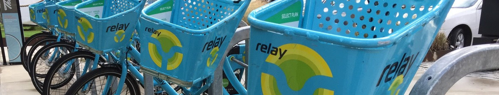

# GA DSI Capstone
## Bicycle Share project
Author: Gwyneth Butera

##  <span style='color:#3b748a'>Bike angels</span>
<span style="color:#3b748a"><a href="https://www.newyorker.com/magazine/2017/12/04/hacking-the-citi-bike-points-system"><span style="color:#3b748a">Hacking the Citi Bike Points System</span></a>:</span>
<blockquote><span style="color:#3b748a">He had arranged to meet Collin Waldoch, who runs Bike Angels, the Citi Bike program that awards points, redeemable for extended membership and other modest benefits (a commemorative pin; a white bike key), to riders who help the company rebalance its network of twelve thousand bikes. Angels earn points for taking bikes from full stations and parking them at empty ones.</span></blockquote>

## The goal
Given bike share rental data in one of the considered cities along with weather data for that city, predict daily bike share usage.

The cities being considered are: Atlanta, Boston, Chicago, Los Angeles, Philadelphia, and San Francisco. There is potential to expand the project to other cities including Washington DC, NYC, and Tampa-St. Pete.

The bike rental data for each city is available for different periods of time and  with different information collected for each city and time period.

## The basic data
Since I live in Atlanta, Atlanta has been my focus. For a general idea of the data involved in this project, review [Inital EDA of ATL data](EDA_ATL.ipynb), [Clean the ATL data](code/clean_atl.ipynb) and [Plot the ATL data](code/plot_atl.ipynb).

## The basic model
Feature building and linear regression modeling are performed in the [Prediction modeling notebook](code/model.ipynb).

## Technical report
The discussion of the project and my findings is in the [Technical Report](reports/04_Milestone.md).

Further details of the data cleaning and explorations are available in the [Detailed data cleaning report](reports/04a_Milestone_Cleaning.md).

## Repository contents
The cities are denoted with codes: atl, bos, chi, la, phl, sf

```
.
+-- reports
    +-- 04_Milestone.md           (Technical report)
    +-- 04a_Milestone_Cleaning.md (Details of data cleaning/EDA)
    +-- 03_Milestone.md           (Milestone 3)
    +-- 02_Milestone.md           (Milestone 2)
+-- code
    +-- main.ipynb                (Overview)
    +-- EDA_ATL.ipynb             (Initial explorations of Atlanta data)
    +-- clean_<city>.ipynb        (Clean data for each city)
    +-- weather.ipynb             (Scrape weather data)
    +-- daylight.ipynb            (Scrape daylight data)
    +-- plot_<city>.ipynb         (Plot data for each city)
    +-- plot_cities.ipynb         (Compare data across cities)
    +-- model.ipynb               (Predict daily bike usage given city and weather)
+-- data
    +-- <city>
        +-- trips_all.csv         (Merge all rental datasets.)
        +-- daily.csv             (Rental data summarized for each day.)
        +-- bikes.csv             (Rental data summarized for each bike.)
        +-- daylight.csv          (Scraped daylight data.)
        +-- weather.csv           (Scraped weather data.)
        +-- Downloaded datasets
+-- images
    +-- Banner images
    +-- Plots for inclusion in the Technical report
```

## Presentation
* See [Google Slides](https://docs.google.com/presentation/d/1wKPg5ixHR6wnIL1Ch6Md7X6fu3xuTKe8wIhZaTIeP10/edit?usp=sharing).


## Notes
Some of the original data and computed data is too large to upload to load to GitHub.

### Milestone 2: Problem Statement, EDA and Dataset
* See [Milestone 2](reports/02_Milestone.md).

### Milestone 3
* See [Milestone 3](reports/03_Milestone.md).

---

### Project planning ideas:
<b>Open items:</b>
- Add DC.
- Clean up all notebooks.
- Customize features by city.
- Some code generalizations.
