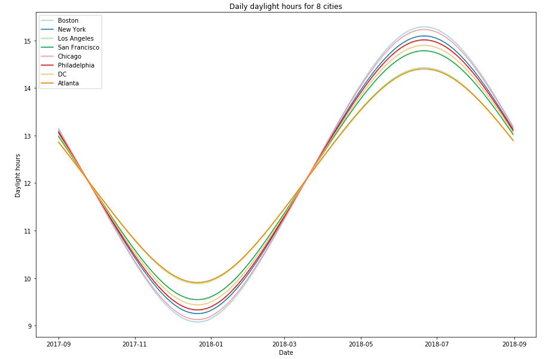
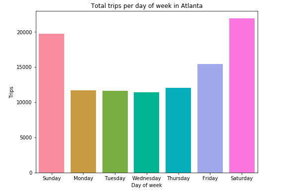
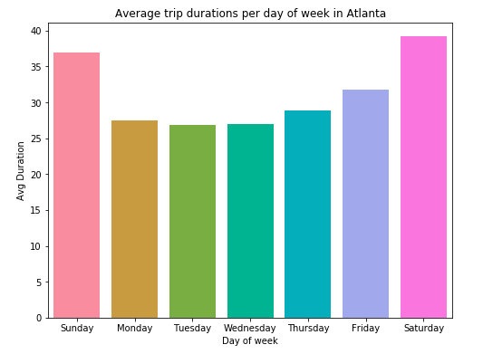
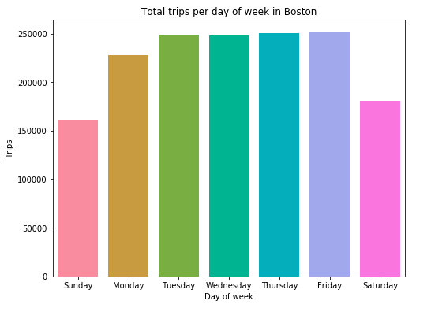
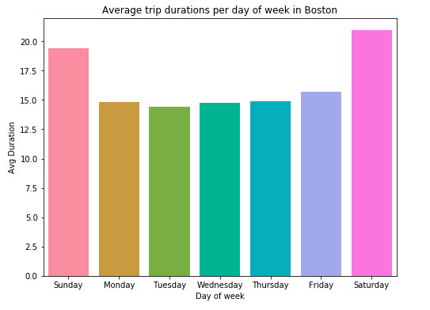
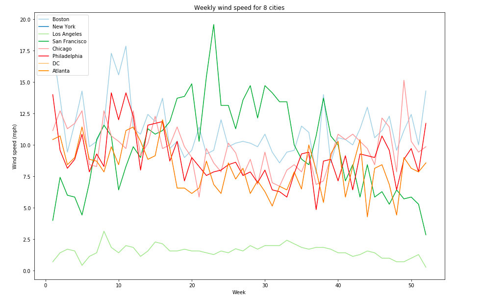
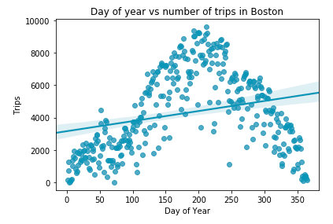
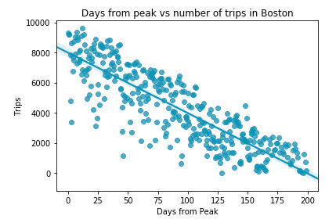
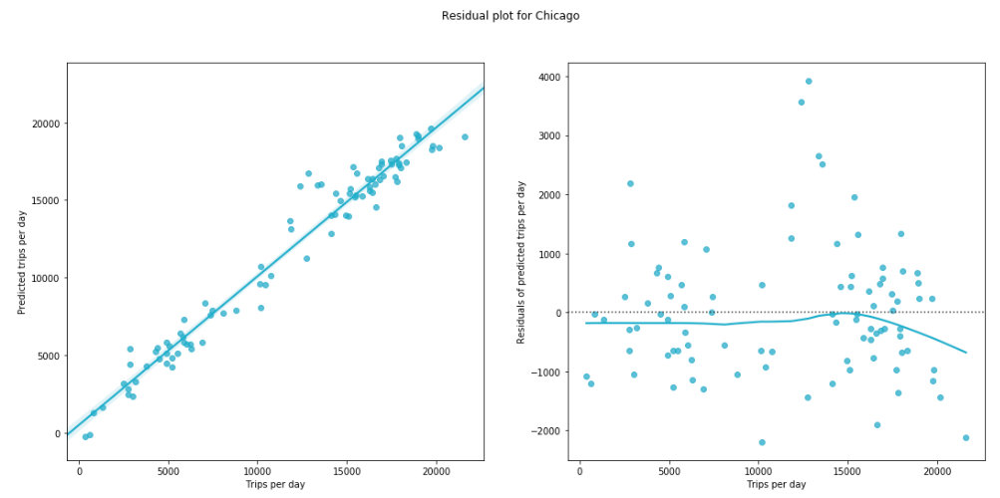

# Technical Report

## Problem statement
[Relay Bike Share](http://relaybikeshare.com/) "is the City of Atlanta’s bike share operator." There are 500 “smart bikes” and over 70 stations (hubs) across the city. Bikes can be rented up at a hub or "out-of-hub" and returned to either a hub or "out-of-hub" within the system area.

The parent company of Relay, [CycleHop](http://cyclehop.com/) operates bike shares in 15+ cities across the US and Canada. Some of the cities, including Atlanta, publish data collected from every rental; each city collects and shares different data. In Atlanta, the data collected includes the start and end information including the hub, latitude, longitude, date, and time. It also includes information about the duration and distance of the rental. In addition, there is bike, user, and payment information collected.

My goal for this project is to <b>"Predict the number of bike rentals for a day given the week of the year, the day of the week, daylight hours, and the weather."</b>

As I worked on the project concentrating on the Atlanta data, I discovered that with some extra data munging, I could expand the scope to include bike shares in Boston, Chicago, Los Angeles, Philadelphia, and San Francisco as well as possibly Washington, DC and NYC.

## Data collection
For Atlanta and the other cities, rental (trip) data is available as CSV files via the local markets' websites. The information collected and published differs from market to market. Also, as the bike shares have been in operation for different periods of time, there is no standard in how often the data is published. Some publish their data monthly, others quarterly. Even within a market, the data collected may change from one time period to the next.

One of the main differences amongst the cities is whether or not the bikes are "smart". Smart bikes do not need to be rented from or returned to a hub. In addition, smart bikes record information regarding the actual distance ridden.

## Exploratory Data Analysis

### Initial data gathering and cleaning
#### Weather data
I scraped weather data from [Weather Underground](https://www.wunderground.com/) for 2017 and 2018 for all the cities. For Boston, there were two days that are missing data: Mar 21-22, 2018; for LA, there were two days that are missing data: Mar 25-26, 2018; for NYC, there were four days that are missing data: Mar 18-22, 2018. I imputed the data from the surrounding days.  Some discussion of the weather scraping script can be found  in [my blog post](http://gobbledygoon.com/2018/10/scraping-weather-data/).
<ul>
<li><a href="../code/weather.ipynb">Notebook for scraping weather data</a></li>
</ul>

#### Daylight data
I also scraped daylight hours data from [timeanddate.com](https://www.timeanddate.com/) for 2017 and 2018 for all the cities listed above.
<ul>
<li><a href="../code/daylight.ipynb">Notebook for scraping daylight data</a></li>
</ul>

#### Atlanta
The dataset for <b>Atlanta</b> covers the months from September 2017 to August 2018. There were 112,657 rentals recorded. I dropped 8736 rows due to the rentals either being trivial (almost 8K tips were shorter than 3 minutes which generally implies a problem with the rental or the bike) or outliers: over 24 hours, 3K miles biked in 3 hours, or the rental occurring in Brooklyn or Athens, GA. I also dropped 14-17 columns, depending on the month, to end up with 13 columns total. There are <code>['Start Hub', 'Start Latitude', 'Start Longitude', 'Start Date', 'Start Time', 'End Hub', 'End Latitude', 'End Longitude', 'End Date', 'End Time', 'Bike Name', 'Distance [Miles]', 'Duration']</code>.
<ul>
<li><a href="../code/EDA_ATL.ipynb">Inital EDA of ATL data</a></li>
<li><a href="../code/clean_atl.ipynb">Clean Atlanta data</a></li>
<li><a href="../code/plot_atl.ipynb">Plot the ATL data</a></li>
</ul>

#### Other cities
For the remainder of the cities I transform the data to match Atlanta's. In some cases, this proved to be a bit more of a challenge than I had anticipated. A deeper discussion of the data cleaning is presented in the [Data Cleaning Report](04a_Milestone_Cleaning.md).

| City  |  Start   |    End    | Original rows | NaNs | Trivial | Outliers | Final rows | % kept  |
| ----- | -------- | --------- | ------------: | ---: | ------: | -------: | ---------: | ------: |
|  ATL	| Sep 2017 | 	Aug 2018 |      112657   |    0 |   8736  |    215   |   103706   |   92.05 |
|  BOS  | Sep 2017 |  Aug 2018 |     1617643   |    0 |  48323  |    962   |  1568358   |   96.95 |
|  CHI  | Jul 2017 |  Jun 2018 |     3724335   |  207 | 135340  |    536   |  3588252   |   96.35 |
|   LA  | Jul 2017 |  Jun 2018 |      286295   |   0  |   8151  |    847   |   277297   |   96.86 |
|  PHL  | Jul 2017 |  Jun 2018 |      761311   | 2633 |  18601  |    322   |   739755   |   97.17 |
|   SF  | Sep 2017 |  Aug 2018 |     1600194   |    0 |  77813  |      7   |  1522374   |   95.14 |

(Here "NaNs" means rows dropped because of a NaN, not # of NaNs in original data.)

#### Boston
In Boston, every bike is rented from and returned to a hub. No distance information is provided, so I calculate the distance between hubs; this is a very inaccurate estimate. There were a couple of hubs with no "real" lat/lon for the hub (0.00) - I believe these are "repair shop" hubs, so I dropped rows with those hubs.
<ul>
<li><a href="../code/clean_bos.ipynb">Clean Boston data</a></li>
<li><a href="../code/plot_bos.ipynb">Plot the BOS data</a></li>
</ul>

#### Chicago
In Chicago, every bike is rented from and returned to a hub. The rental data does not give lat/lon values, only hub data, so I had to merge the rental data with the spreadsheet of hub locations. Some locations did not have lat/lon in that listing, so I had to determine the lat/lon for those hubs "by hand" based on the name (location-based) of the hub. No distance information is provided, so I calculate the distance between hubs; this is a very inaccurate estimate. There were a couple of hubs with no "real" name or lat/lon for the hub (0.00) - I believe these are "repair shop" hubs, so I dropped rows with those hubs.
<ul>
<li><a href="../code/clean_chi.ipynb">Clean Chicago data</a></li>
<li><a href="../code/plot_chi.ipynb">Plot the CHI data</a></li>
</ul>

#### Los Angeles
In Los Angeles, every bike is rented from and returned to a hub, though there is one "virtual" hub for festivals, etc. No distance information is provided, so I calculate the distance between hubs; this is a very inaccurate estimate.
<ul>
<li><a href="../code/clean_la.ipynb">Clean Los Angeles data</a></li>
<li><a href="../code/plot_la.ipynb">Plot the LA data</a></li>
</ul>

#### Philadelphia
In Philadelphia, every bike is rented from and returned to a hub, though there is one "virtual" hub for festivals, etc. No distance information is provided, so I calculate the distance between hubs; this is a very inaccurate estimate.
<ul>
<li><a href="../code/clean_phl.ipynb">Clean Philadelphia data</a></li>
<li><a href="../code/plot_phl.ipynb">Plot the PHL data</a></li>
</ul>

#### San Francisco
In San Francisco, every bike is rented from and returned to a hub. No distance information is provided, so I calculate the distance between hubs; this is a very inaccurate estimate. There are 7.2K rentals from unnamed hubs. There were 3 rentals in Minneapolis and 4 in Montreal.
<ul>
<li><a href="../code/clean_sf.ipynb">Clean San Francisco data</a></li>
<li><a href="../code/plot_sf.ipynb">Plot the SF data</a></li>
</ul>

### Further data explorations
#### Atlanta
In my notebook [Plot Atlanta data](../code/plot_atl.ipynb), I explore the data deeply, plotting over different aggregations (daily, weekly, monthly, day of the week). I plot bike, weather, and daylight data as well as a heat map of the correlations. I also look at regression plots of # of trips versus different features and experiment with creating new features such as "Days from Peak" and various combinations of Precipitation and Temperatures. At first glance, it appears that the bike share in Atlanta is generally for recreational use. Usage, duration, and distance all increase on weekends and bank holidays. Daylight and temperature are correlated with the number of rentals.

##### Some interesting outliers:
<ul>
<li> Days with high rental volume, distance, or duration include: 
Fourth of July, Labor Day, Easter Monday, and the 2018 Atlanta Moon Ride.</li>
<li> Days with low rental volume, distance, or duration include: 
Christmas Day, Hurricane Irma 3.5in rain (11 sep 2017), and on days that it snowed.
</ul>

<table border="0"><tr>
<td></td>
<td></td>
</tr></table>

#### Other cities
For the remainder of the cities I create similar plots. Though I create distance plots even for cities where I use a "calculated" distance, these plots don't have much meaning.

#### Boston
At first glance, it appears that the bike share in Boston is used heavily by commuters, though some recreational use occurs as well; while fewer rentals are made on weekends, average trip durations increase on the weekends. Usage falls off in the winter months, not surprisingly; temperature and daylight are highly correlated with the number of rentals.

##### Some interesting outliers:
<ul>
<li> Days with high rentals, distance, or duration include: 
Fourth of July, Memorial Day, and July 31 (not sure why).</li>
<li> Days with low rentals, distance, or duration include: 
13 Mar 2018 had no rentals. There was a blizzard with 14in snow that day.
</ul>

<table border="0"><tr>
<td></td>
<td></td>
</tr></table>

#### Chicago
At first glance, it appears that the bike share in Chicago is balanced between commuters and recreational use. The number of trips by day of week is somewhat constant, though total duration of rentals increases on the weekends. Usage falls off in the winter months, not surprisingly; temperature, daylight, and wind are highly correlated with the number of rentals.

##### Some interesting outliers:
<ul>
<li> Days with high rentals, distance, or duration include: 
Sundays in July, Labor Day, Fourth of July, Memorial Day weekend
<li> Days with low rentals, distance, or duration include: 
Christmas, Christmas Eve, New Years', New Years' Eve
</ul>

#### Los Angeles
At first glance, it appears that the bike share in Los Angeles is well-balanced between commuters and recreational use. The number of trips by day of week is somewhat constant, though total duration of rentals increases greatly on the weekends. Usage is quite constant throughout the year; precipitation is highly correlated with the number of rentals. Daylight and temperature are somewhat correlated.

##### Some interesting outliers:
<ul>
<li> Days with high rentals, distance, or duration include: 
8 oct 2017 (Ciclavia: Heart of LA - "Open streets") 2K trips while the next fewest is 1.2K, Christmas, New Years'
<li> Days with low rentals, distance, or duration include: 
Rainy days
</ul>

#### Philadelphia
At first glance, it appears that the bike share in Philadelphia is used heavily by commuters, though some recreational use occurs as well; while fewer rentals are made on weekends, average trip durations increase slightly on the weekends. Usage falls off in the winter months, not surprisingly; temperature and daylight are highly correlated with the number of rentals.

##### Some interesting outliers:
<ul>
<li> Days with high rentals, distance, or duration include: 
New Years' Day, Labor Day, 26 jul 2017 (XPoNential Music Fest)
<li> Days with low rentals, distance, or duration include: 
Snowy days
</ul>

#### San Francisco
At first glance, it appears that the bike share in San Francisco is used heavily by commuters, though some recreational use occurs as well; while fewer rentals are made on weekends, average trip durations increase slightly on the weekends. It is hard to tell if usage falls off in the winter. With only one year of data, it could be that the increase could be either seasonal of just growing. Usage is correlated with daylight and date.

##### Some interesting outliers:
<ul>
<li> Days with high rentals, distance, or duration include: 
25 jul 2018 - Phish(?), Labor Day, Thanksgiving, Christmas, New Years
25 dec 2017
1 jan 2018
<li> Days with low rentals, distance, or duration include: 
Moday following Thanksgiving
</ul>

#### City data
Looking at heat maps of correlations, it is clear that certain features are more important for some cities than for others. In [Compare data across cities](../code/plot_cities.ipynb), I plot rental data, bike data, weather data, and daylight data across the various cities.

## Modeling
In the notebook [Model the problem](../code/model.ipynb), I currently only consider one city at a time. For the given city, I load in the rental (trip) data, the weather data, and the daylight data. After a little cleaning, I group the rental data by date (so there is one row per city) and then merge with the weather and daylight data. After generating week and day of week for each record, I make dummies on the day of the week. I drop some columns so the features that remain are <code>['hum_avg', 'prec', 'temp_avg', 'wind_avg', 'Daylight', 'Date', 'DayOfYear', 'Week', 'Month', 'Year']</code>.

I also add a new feature, "Days from Peak". For each city the "peak of summer" is different. For example, in the Northeast, schools are typically out from end of June to beginning of September, while in the South, school summer vacation is shifted to be June and July.

<table border="0"><tr>
<td></td>
<td></td>
</tr></table>

As I want to predict the number of rides on a day given these features, I used a number of linear regression models.

### Strategy
For one of our class projects, I developed a <a href="http://gobbledygoon.com/2018/09/python-generalized-pipeline/">Generalized Pipeline</a>, so I started with this pipeline. The pipeline makes it possible to scale, create polynomial features, use PCA (principal component analysis), and search over parameters for a large number of regression models including:
<ul>
<li> <code>LinearRegression</code></li>
<li> <code>Ridge</code></li>
<li><code>Lasso</code></li>
<li><code>ElasticNet</code></li>
<li><code>RandomForestRegressor</code></li>
<li><code>GradientBoostingRegressor</code></li>
<li><code>AdaBoostRegressor</code></li>
<li><code>KNeighborsRegressor</code></li>
</ul>

### Results

Trying out various features (day, week, weather, etc), polynomial features, scaling, PCA, and regression models, the best results varied by city, but in general, the best results were using:
<ul>
<li> scaling,</li>
<li> no polynomial features,</li>
<li> no PCA, and </li>
<li> Gradient Boost. </li>
</ul>

|     |	Gradient Boost |    Train     |    Test      | Features |
| :-: | :-----------:  | :----------: | -----------: | -------: |
| ATL |       325      | 0.7205557045 | 0.6566920974 | Humidity, Precipitation, Temperature, Daylight, DaysFromPeak, DayOfWeek, Year |
| BOS |       330      | 0.9047285172 | 0.943948623  | Humidity, Precipitation, Temperature, Wind Speed,  Daylight, DaysFromPeak, DayOfWeek, Year |
| CHI |       324      | 0.9261900475 | 0.9637349791 | Humidity, Precipitation, Temperature, Wind Speed,  Daylight, DaysFromPeak, DayOfWeek, Year |
| LA  |       328      | 0.4112204728 | 0.7040064071 | Humidity, Precipitation, Temperature, Wind Speed,  Daylight, DaysFromPeak, DayOfWeek, Date, Week |
| PHL |       332      | 0.8858561748 | 0.9243714654 | Humidity, Precipitation, Temperature, Wind Speed,  Daylight, DaysFromPeak, DayOfWeek, Date, Week, Year |
| SF  |       324      | 0.8954245704 | 0.9320860003 | Humidity, Precipitation, Temperature, Wind Speed,  Daylight, DaysFromPeak, DayOfWeek, Date, Week, Year |

## Future steps
- Daylight and/or peak summer (one linear, one more like a sine curve)
  - The seasonal usage curve is something to explore further.
- Find and add air quality metrics (LA!)
- Investigate time series
- Examine time of day/cumulative usage of bikes
- Examine bike data
  - Shuffle to aim for even wear and tear
- Examine hub data
  - Usage of hubs
  - Rebalancing
  - Roundtrip vs one-way (LA?)
- Examine user data
- Explore more cities (NYC, Tampa, etc)
