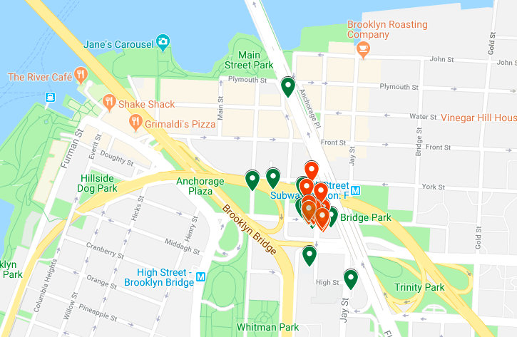

## Data Cleaning

### Rental (trip) data
The columns we are keeping (or calculating) are: The final 13 columns are: <code>['Start Hub', 'Start Latitude', 'Start Longitude', 'Start Date', 'Start Time', 'End Hub', 'End Latitude', 'End Longitude', 'End Date', 'End Time', 'Bike Name', 'Distance [Miles]', 'Duration']</code>.

### Atlanta

<ul>
    <li><a href="http://relaybikeshare.com/system-data/">Relay (Atlanta) Data</a></li>
    <li>12 months: Sep 2017 - Aug 2018</li>
    <li><a href="../code/EDA_ATL.ipynb">Notebook to explore one month of data.</a></li>
    <li><a href="../code/clean_atl.ipynb">Process all Atlanta data.</a></li>
    <li><a href="https://drive.google.com/open?id=1dmQKwa5N0Ia0cFGdeu4oaTXFp0R6hIBO&usp=sharing">Map of outliers.</a></li>
    <li><a href="../code/plot_atl.ipynb">Plot all Atlanta data.</a></li>
    <li>Cleaned data in "../data/atl/trips_all.csv"</li>
</ul>

<b>Initial observations:</b> The original Atlanta files have 12 months of ride data from September 2017 to August 2018. Eleven months are in csv form but September 2017 is an html file. I imported the html file into a csv file and did a little cleaning both on the csv file directly and via the cleaning notebook. I exported the month to a csv file similar to the other ten months. There were a handful of records across the 12 months that did not have latitude and longitude data; for the trips that had hubs, I inferred the lat/lon from other rows. If there was no hub data, I deleted the rows; there were only a dozen or so of these rows. A number of rows did not have hub data; Atlanta does allow for bikes to be picked up or returned at places that are not hubs. Altogether (start and end) there are 32K rows without hub data.

<b>Cleaning:</b> 14-17 columns were dropped, depending on the month. No columns need to be renamed, and no lat/long need to be calculated after the first pass on the csv files as mentioned previously. Once the useless columns were dropped and the null hubs were changed to 'None', there was no null data to manage. The latitude and longitude values were cast to float. The Date+Time and Date were cast to Datetime. The Duration, given in HH:MM:SS, was cast to timedate. There are no distances to calculate; these distances appear to be actual distances traveled.  The columns do not need to be reordered.

<b>Dropped rows:</b> The initial data had 112K rows, but some trivial and outlier rows were then dropped. A trivial trip is defined as one that is shorter than 3 minutes OR is shorter than 0.02 miles. A couple of outliers in lat/long were also dropped. Trips longer than 24 hours OR with a distance greater than 100.0 miles were dropped. There were almost 9K trivial rows (almost 8K are for time shorter than 3 minutes) and outlier rows dropped. The map of the lat/lon outliers is <a href="https://drive.google.com/open?id=1dmQKwa5N0Ia0cFGdeu4oaTXFp0R6hIBO&usp=sharing">here</a>. Most of the outliers were in Brooklyn, but another was in Athens, GA.

| Atlanta | Rows  | Cols |   NaNs    | Trivial trips | Outliers | Rows  |
| ------- | ----: | ---: | --------: | ------------: | -------: | ----: |
| 201709  | 14476 | 27   |   19277	 |     1043      |   10     | 13423 |
| 201710  | 10466 | 27   |   13733   |     803       |   10     |  9653 |
| 201711  | 8672  | 27   |   11485   |     682       |    4     |  7986 |
| 201712  | 4348  | 27   |    6001   |     407       |    5     |  3936 |
| 201801  | 3933  | 30   |   17363   |     462       |    5     |  3466 |
| 201802  | 7008  | 30   |   30612   |     530       |   17     |  6461 |
| 201803  | 8815  | 30   |   39045   |     881       |   22     |  7912 |
| 201804  | 11330 | 30   |   49968   |     1120      |   39     | 10171 |
| 201805  | 12449 | 30   |   55407   |     1138      |   36     | 11275 |
| 201806  | 11622 | 30   |   50909   |     568       |   29     | 11025 |
| 201807  | 10986 | 30   |   49713   |     582       |   20     | 10384 |
| 201808  |  8552 | 30   |   38456   |     520       |   18     |  8014 |
| Total: | 112657 |      |  381969   |    8736       |  215    | 103706 |

### Boston

<ul>
    <li><a href="https://www.bluebikes.com/system-data">Bluebikes (Boston) Data</a></li>
    <li>Data goes back to 2015.</li>
    <li>12 months: Sep 2017 - Aug 2018</li>
    <li><a href="../code/clean_bos.ipynb">Process all Boston data.</a></li>
    <li><a href="../code/plot_bos.ipynb">Plot all Boston data.</a></li>
    <li>Cleaned data in "../data/bos/trips_all.csv"</li>
    <li>Pre-cleaning: Trips shorter than one minute were removed by Bluebikes.</li>
</ul>

#### Issues:
<ul>
    <li>A couple of hubs are "repair" hubs. </li>
    <li>Distance is calculated based on hub lat/lon, thus could be underestimated or falsely trivial.</li>
    <li>Too large to push to GitHub.</li>
    <li>Weather was missing for Mar 25-26, 2018.  </li>
    </li>
</ul>

<b>Cleaning:</b> There were initially 15 columns. The columns were reconfigured in order to match the Atlanta data. Once the columns were reconfigured, there was no null data to manage. Distances were calculated based on lat/lon of the hubs.

<b>Dropped rows:</b> A trivial trip is defined as one that is shorter than 3 minutes. Outliers in lat/long were dropped: these are 0.00/0.00 lat/lon values used for "repair" sites. Trips longer than 24 hours were dropped as well.

| Boston |  Rows  | NaNs | Cols | Outlier/Trivial | Final Rows |
| -----: | -----: | ---: | ---- | ---------- | --------: |
| 201709 | 165386 |    0 |   15 |    4957    |   160429   |
| 201710 | 163662 |    0 |   15 |    5613    |   158049   |
| 201711 | 105463 |    0 |   15 |    4674    |   100789   |
| 201712 |  55072 |    0 |   15 |    2233    |    52839   |
| 201801 |  40932 | 1539 |   15 |    1559    |    39373   |
| 201802 |  62817 | 3497 |   15 |    2481    |    60336   |
| 201803 |  62986 | 4556 |   15 |    2471    |    60515   |
| 201804 |  98194 |    0 |   15 |    3685    |    94509   |
| 201805 | 178850 |    0 |   15 |    4735    |   174115   |
| 201806 | 205352 |    0 |   15 |    5075    |   200277   |
| 201807 | 242891 |    0 |   15 |    6113    |   236778   |
| 201808 | 236038 |    0 |   15 |    5689    |   230349   |
| Total: | 1617643 | 9592 |     |   49285    |  1568358   |

### <b>Chicago</b>
<ul>
    <li><a href="https://www.divvybikes.com/system-data">Divvy (Chicago) Data</a></li>
    <li>Data goes back to 2013.</li>
    <li>12 months: July 2017 - June 2018</li>
    <li><a href="..code/clean_chi.ipynb">Process all Chicago data.</a></li>
    <li><a href="../code/plot_chi.ipynb">Plot all Chicago data.</a></li>
    <li>Cleaned data in "../data/chi/trips_all.csv"</li>
</ul>

#### Issues:
<ul>
    <li>Need to calculate Lat/Long by merging with hub data; some hubs are lacking data and needed to have lat/lon added by hand.</li>
    <li>One of the quarterly datafiles was too big and had to be broken into months first.</li>
    <li>A couple of hubs are "repair" hubs. </li>
    <li>Distance is calculated based on hub lat/lon, thus could be underestimated or falsely trivial.</li>
    <li>Too large to push to GitHub.</li>
</ul>

<b>Initial observations:</b> The rental data provides hub names and ids, but not lat/lon. By merging with the hub spreadsheet, these values could be added. Unfortunately, there were 21 hubs that did not have lat/lon provided, so these were calculated "by hand" from Google maps and added to the hubs spreadsheet.

<b>Cleaning:</b> There were initially 12 columns. The columns were reconfigured in order to match the Atlanta data. Once the columns were dropped, the only null data remaining was for the "repair" hubs. Rentals starting at or ending at those hubs were dropped. Distances were calculated based on lat/lon of the hubs.

<b>Dropped rows:</b> A trivial trip is defined as one that is shorter than 3 minutes. Outliers in lat/long were dropped: these are 0.00/0.00 lat/lon values used for "repair" sites. Trips longer than 24 hours were dropped as well.

| Chicago |   Rows  |   NaNs  | Drop NaNs | Trivial | Outliers |   Rows  |
| ------: | ------: | ------: | --------: | ------: | -------: | ------: |
|  201707 |  565142 |  358366 |     0     |   14746 |      0   |  550396 |
|  201708 |  557639 |  291943 |     0     |   16117 |      0   |  541522 |
|  201709 |  485489 |  232319 |     0     |   15985 |      0   |  469504 |
| 2017 Q4 |  669239 |  157407	|     0     |   31460 |      0   |  637779 |
| 2018 Q1 |  387145 |   44815 |    62     |   21186 |    116   |  365781 |
| 2018 Q2 | 1059681 |  391775 |   145     |   35846 |    420   | 1023270 |
|  Total: | 3724335 | 1476625 |   207     |  135340 |    536   | 3588252 |  

### <b>Los Angeles</b>
<ul>
    <li><a href="https://bikeshare.metro.net/about/data/">Metro Bike Share (Los Angeles) Data</a></li>
    <li><a href="code/clean_la.ipynb">Process all LA data.</a></li>
    <li>Data goes back to July 2016.</li>
    <li>12 months: Jul 2017 - Jun 2018</li>
    <li><a href="..code/clean_la.ipynb">Process all LA data.</a></li>
    <li><a href="../code/plot_la.ipynb">Plot all LA data.</a></li>
    <li>Cleaned data in "../data/la/trips_all.csv"</li>
</ul>

#### Issues:
<ul>
    <li>Pre-cleaning: Trips shorter than one minute were removed by Metro. Trips longer than 24 hours were changed to 24 hours.</li>
    <li>Missing Lat/Lon for "virtual hubs"; gave "Hub 3000" the lat/lon of central LA.</li>  
    <li>Calculated distance; could be underestimated or falsely trivial.</li>
    <li>Weather was missing for March 21-22, 2017.</li>  
</ul>

<b>Initial observations:</b> The virtual hubs (festivals, temporary hubs, etc.) were all given the name "Hub 3000" unlike in Atlanta.

<b>Cleaning:</b> There were initially 14 columns. The columns were reconfigured in order to match the Atlanta data. Once the columns were dropped, the only null data remaining was for the lat/lon of "Virtual" hubs; these were assigned the lat/lon of central LA. Distances were calculated based on lat/lon of the hubs.

<b>Dropped rows:</b> A trivial trip is defined as one that is shorter than 3 minutes. Trips greater than or equal to 24 hours were dropped as well.

|    LA   |  Rows  | NaNs  | Trivial | Outliers |   Rows |
| ------- | -----: | ----: | ------: | -------: | -----: |
| 2017 Q3 |  72337 |  1598 |    2283 |      149 |  69905 |
| 2017 Q4 |  71214 |  3750 |    2011 |      212 |  68991 |
| 2018 Q1 |  65387 |  2226 |    1770 |      207 |  63410 |
| 2018 Q2 |  77357 |  2486 |    2087 |      279 |  74991 |
| Total:  | 286295 | 10060 |    8151 |      847 | 277297 |

### <b>Philadelphia</b>
<ul>
    <li><a href="https://www.rideindego.com/about/data/">Indego (Philly) Data</a></li>
    <li>Data goes back to April 2015.</li>
    <li>12 months: Jul 2017 - Jun 2018</li>
    <li><a href="../code/clean_phl.ipynb">Process all Philly data.</a></li>
    <li><a href="../code/plot_phl.ipynb">Plot all Philly data.</a></li>
    <li>Cleaned data in "../data/la/trips_all.csv"</li>
</ul>

#### Issues:
<ul>
    <li>Pre-cleaning: Trips shorter than one minute were removed by Indego. Trips longer than 24 hours were changed to 24 hours.</li>
    <li>Missing Lat/Lon for "virtual hubs"; gave "Hub 3000" the lat/lon of central Philly.</li>
    <li>Calculated distance; could be underestimated or falsely trivial.</li>hubs.</li>
    <li>Hub 3185 has latitude -39.951759.</li>
    <li>Too large to push to GitHub.</li>
</ul>

<b>Initial observations:</b> The virtual hubs (festivals, temporary hubs, etc.) were all given the name "Hub 3000" unlike in Atlanta.

<b>Cleaning:</b> There were initially 14 columns. The columns were reconfigured in order to match the Atlanta data. Once the columns were dropped, the only null data remaining was for the lat/lon of "Virtual" hub; these were assigned the lat/lon of central Philly Distances were calculated based on lat/lon of the hubs.

<b>Dropped rows:</b> A trivial trip is defined as one that is shorter than 3 minutes. Trips greater than or equal to 24 hours were dropped as well. There were 3 "long trips"; these came from bad lat/lon data and could have been cleaned - Hub 3185 has latitude -39.951759.

|  Philly  |  Rows  | NaNs  | Nan Loc | Trivial | Outliers |  Rows  |
| -------: | -----: | ----: | ------: | ------: | -------: | -----: |
|  2017 Q3 | 276785 |  3980 |       0 |    6398 |      143 | 270244 |
|  2017 Q4 | 183909 |  3022 |       0 |    4313 |      108 | 179488 |
|  2018 Q1 |  98993 |  2342	|     925 |    2618 |       34 |  95416 |
|  2018 Q2 | 201624 |  3576	|    1708 |    5272 |       37 | 194607 |
|   Total: | 761311 | 12920 |    2633 |   18601 |      322 | 739755 |

### <b>San Francisco</b>
<ul>
    <li><a href="https://www.fordgobike.com/system-data">Ford GoBike (SF) Data</a></li>
    <li>Data goes back to 2017.</li>
    <li>12 months: Sep 2017 - Aug 2018</li>
    <li><a href="code/clean_sf.ipynb">Process all SF data.</a></li>
    <li><a href="../code/plot_sf.ipynb">Plot all SF data.</a></li>
    <li>Cleaned data in "../data/sf/trips_all.csv"</li>
</ul>

#### Issues:
<ul>
    <li>Pre-cleaning: Trips shorter than one minute were removed by Ford GoBike. Trips longer than 24 hours were changed to 24 hours.</li>
    <li>The 2017 datafile was too big and had to be broken into months first.</li>
    <li>Calculated distance; could be underestimated or falsely trivial.</li>hubs.</li>
    <li>7.2K rows have a hub with no name. The lat/lon are similar for most, but not all.</li>
    <li>Too large to push to GitHub.</li>
</ul>

<b>Initial observations:</b> A number rentals (7.2K) have hubs that are unnamed, but provide a lat/lon. I rename them "Unknown".</b>

<b>Cleaning:</b> There were initially 15/16 columns. The columns were reconfigured in order to match the Atlanta data. Once the columns were dropped, there was no null data to manage.

<b>Dropped rows:</b> A trivial trip is defined as one that is shorter than 3 minutes. There were no trips greater than or equal to 24 hours were dropped as well. Three of the outliers were in Minneapolis; four were in Montreal. 

|   SF   |   Rows  |  NaNs  | Trivial | Outliers |   Rows  |
| ------ | ------: | -----: | ------: | -------: | ------: |
| 201709 |   98558 |  26242 |    3483 |        0 |   95075 |
| 201710 |  108937 |  27222 |    4240 |        0 |  104697 |
| 201711 |   95612 |  19005 |    4024 |        0 |   91588 |
| 201712 |   86539 |  16586 |    3680 |        0 |   82859 |
| 201801 |   94802 |  15640 |    4132 |        0 |   90670 |
| 201802 |  106718 |  16148 |    4859 |        0 |  101859 |
| 201803 |  111382 |  18032	|    5065 |        0 |  106317 |
| 201804 |  131169 |  18720	|    6688 |        0 |  124481 |
| 201805 |  179125 |  23461	|   10380 |        0 |  168745 |
| 201806 |  195968 |  33414	|   10863 |        4 |  185101 |
| 201807 |  199222 |  37555	|   10678 |        0 |  188544 |
| 201808 |  192162 |  33438	|    9721 |        3 |  182438 |
| Total: | 1600194 | 285463 |   77813 |        7 | 1522374 |

### <b>Washington, DC (coming soon)<</b>
<ul>
    <li><a href="https://www.capitalbikeshare.com/system-data">Capital BikeShare (DC) data</a></li>
    <li><a href="clean_dc.ipynb">Process all DC data.</a></li>
    <li>Data goes back to 2010.</li>
</ul>

#### Issues:
<ul>
<li>No lat/lon data, had to create a hub file from scratch.</li>
</ul>

### <b>NYC (coming soon)</b>
<ul>
    <li><a href="https://www.citibikenyc.com/system-data">CitiBikes (NYC) Data</a></li>
</ul>
